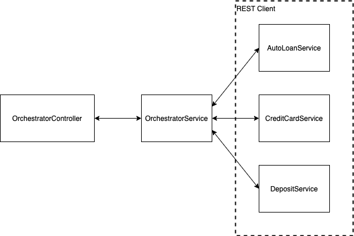

# Banking Case Study

You're going to create a banking application.  The banking application has the following lines of business (LoBs):

* Deposit Accounts
* Credit Card Accounts
* Auto Loan Accounts

The bank has decided to consolidate and display on the dashboard (a non-existent UI), all the accounts belonging to a particular customer once they log into the banking application.
 
#### Overall Deliverables
* Design and build a REST service for deposit accounts.
* Design and build a REST service for credit card accounts.
* Design and build a REST service for auto loan accounts.
* Design and build a REST service for aggregating data from the 3 previous microservices.
* Use patterns discussed in class (MVC, 3-tier, Builder).
 
#### Reference Documentation
For further reference, please consider the following:

* [Official Apache Maven documentation](https://maven.apache.org/guides/index.html)
* [Spring Boot Maven Plugin Reference Guide](https://docs.spring.io/spring-boot/docs/2.2.4.RELEASE/maven-plugin/)
* [Spring Boot Actuator](https://docs.spring.io/spring-boot/docs/2.2.4.RELEASE/reference/htmlsingle/#production-ready)
* [Spring Web](https://docs.spring.io/spring-boot/docs/2.2.4.RELEASE/reference/htmlsingle/#boot-features-developing-web-applications)
* [Spring Data JPA](https://docs.spring.io/spring-boot/docs/2.2.4.RELEASE/reference/htmlsingle/#boot-features-jpa-and-spring-data)
* [Spring Boot DevTools](https://docs.spring.io/spring-boot/docs/2.2.4.RELEASE/reference/htmlsingle/#using-boot-devtools)

#### Guides
The following guides illustrate how to use some features concretely:

* [Building a RESTful Web Service with Spring Boot Actuator](https://spring.io/guides/gs/actuator-service/)
* [Building a RESTful Web Service](https://spring.io/guides/gs/rest-service/)
* [Consuming a RESTful Web Service](https://spring.io/guides/gs/consuming-rest/)
* [Serving Web Content with Spring MVC](https://spring.io/guides/gs/serving-web-content/)
* [Building REST services with Spring](https://spring.io/guides/tutorials/bookmarks/)
* [Accessing Data with JPA](https://spring.io/guides/gs/accessing-data-jpa/)
* [Jackson Annotation Examples](https://www.baeldung.com/jackson-annotations)
* [Hystrix Circuit Breaker](https://spring.io/guides/gs/circuit-breaker/)
* [RestTemplate Timeout Example](https://howtodoinjava.com/spring-boot2/resttemplate/resttemplate-timeout-example/)
* [@JsonInclude Example](https://www.java67.com/2019/09/3-ways-to-ignore-null-fields-in-json-java-jackson.html)

## Microservice Details
Details for each microservice are below.

## Auto Loan Microservice
Using the patterns and standards you learned in this class, design and build a microservice to manage auto loan accounts.


The microservice needs to have the following items implemented:

* Needs to be a REST service.
* All CRUD endpoints need to be implemented (5 in total).
    * createLoan
    * updateLoan
    * deleteLoan
    * There need to be 2 READ endpoints:
        * getLoansByClientId
        * getAllLoans
    
### Endpoint Detail
##### /autoloan/createLoan
* Accepts loan information from request body.
* Returns loan created in response body.
* Returns a 200 status code if successful.
* Use JPA and H2 to store *AutoLoan* objects.
* The model class needs to implement an inner builder.  (Builder pattern implemented as an inner class.)
* If the database is unavailable, a default message should be returned in the response body.
    ```json
    {
      "defaultMessage" : "No accounts available to show currently"
    }
    ```
    This message can be part of the data model and is excluded from the response body when it is null.  Conversely, when the default message is sent, no other key/value pairs from the model are sent in the response body.  See reference documentation on how to do this.
    * [@JsonInclude Example](https://www.java67.com/2019/09/3-ways-to-ignore-null-fields-in-json-java-jackson.html)
    
###### Request Body

```json
{           
  "clientId" : "001",    
  "name" : "Homer Simpson",
  "balance" : "15000.0"
}     
```
    
###### Response Body

```json
{           
  "id" : "1",  
  "clientId" : "001",    
  "name" : "Homer Simpson",
  "balance" : "15000.0"
}     
```

##### /autoloan/getLoansByClientId/{clientId}
* Returns loans queried in response body.
* Returns a 200 status code if successful.

###### Request

```text
  http://localhost:9091/autoloan/getLoanById/1
```

###### Response Body

```json
[
  {
    "id": "1",
    "clientId" : "001",          
    "name": "Homer Simpson",
    "balance": "15000.0"
  }
]     
```

##### /autoloan/getAllLoans
* Returns a list of all loan information in the system.
* Returns a 200 status code if successful.

###### Request

```text
  http://localhost:9091/autoloan/getAllLoans
```

###### Response Body

```json
[
  {
    "id": "1",
    "clientId" : "001",          
    "name": "Homer Simpson",
    "balance": "15000.0"
  },
  {
    "id": "2",
    "clientId" : "004",          
    "name": "Marge Simpson",
    "balance": "10000.0"
  } 
] 
```

##### /autoloan/updateLoan/{id}
* Accepts loan information from request body.
* Returns loan updated in response body.
* Returns a 200 status code if successful.

###### Request

```text
    http://localhost:9091/autoloan/updateLoan/1
```
        
###### Request Body

```json
{    
  "clientId" : "001",      
  "name": "Homer J Simpson"
}     
```

###### Response Body

```json
{
  "id": "1",
  "clientId" : "001",          
  "name": "Homer J Simpson",
  "balance": "15000.0"
}     
```
        
##### /autoloan/deleteLoan/{id}
* Returns a 204 status code if successful.
* Returns a 404 status code if unsuccessful.

###### Request
```text
    http://localhost:9091/autoloan/deleteLoan/1
```

###### Example of unsuccessful message:
```text
    Record not deleted.
```

## Credit Card Microservice
Using the patterns and standards you learned in this class, design and build a microservice to manage credit card accounts.


The microservice needs to have the following items implemented:

* Needs to be a REST service.
* Use JPA and H2 to store *CreditCard* objects.
* The model class needs to implement an inner builder.  (Builder pattern implemented as an inner class.)
* All CRUD endpoints need to be implemented (5 in total).
    * createCreditCard
    * updateCreditCard
    * deleteCreditCard
    * There need to be 2 READ endpoints:
        * getCreditCardsByClientId
        * getAllCreditCards
* Credit card numbers are all randomly generated, unique, 16 digit numbers.  The first four numbers of the account number are always 1234.
* If the database is unavailable, a default message should be returned in the response body.
    ```json
    {
      "defaultMessage" : "No accounts available to show currently"
    }
    ```
    This message can be part of the data model and is excluded from the response body when it is null.  Conversely, when the default message is sent, no other key/value pairs from the model are sent in the response body.  See reference documentation on how to do this.
    * [@JsonInclude Example](https://www.java67.com/2019/09/3-ways-to-ignore-null-fields-in-json-java-jackson.html)
     
### Endpoint Detail
##### /creditcard/createCreditCard
* Accepts credit card information from request body.
* Returns credit card created in response body.
* Returns a 200 status code if successful.
###### Request

```text
    http://localhost:9092/creditcard/createCreditCard
```

###### Request Body

```json
{        
  "clientId" : "001",
  "number": "1234 5678 9012 3456",      
  "name": "Homer Simpson",
  "balance": "500.0"
}     
```
        
###### Response Body

```json
{        
  "id" : "1",  
  "clientId" : "001",
  "number": "1234 5678 9012 3456",      
  "name": "Homer Simpson",
  "balance": "500.0"
}     
```

##### /creditcard/getCreditCardsByClientId/{clientId}
* Returns credit card queried in response body.
* Returns a 200 status code if successful.
    
###### Request
```text
    http://localhost:9092/creditcard/getCreditCardsByClientId/1
```
###### Response Body
```json
[
  {
    "id": "1",
    "clientId" : "001",
    "number": "1234 5678 9012 3456",      
    "name": "Homer Simpson",
    "balance": "500.0"
  } 
]    
```
##### /creditcard/getAllCreditCards
* Returns a list of all loan information in the system.
* Returns a 200 status code if successful.

###### Response Body
```json
[
 {
    "id": "1",
    "clientId" : "001",
    "number": "1234 5678 9012 3456",      
    "name": "Homer Simpson",
    "balance": "500.0"
 },
 {
    "id": "2",
    "clientId" : "004",
    "number": "9876 5432 1098 7654",      
    "name": "Marge Simpson",
    "balance": "100.0"
 } 
] 
```
##### /creditcard/updateCreditCard/{id}
* Accepts credit card information from request body.
* Returns credit card updated in response body.
* Returns a 200 status code if successful.

###### Request

```text
    http://localhost:9092/creditcard/updateCreditCard/1
```
    
###### Request Body

```json
{
  "clientId": "001",
  "number": "1234 5678 9012 3456",      
  "name": "Homer J Simpson"
}     
```
        
###### Response Body

```json
{
  "id" : "1",
  "clientId": "001",
  "number": "1234 5678 9012 3456",      
  "name": "Homer J Simpson",
  "balance": "100.0"
}     
```

##### /creditcard/deleteCreditCard/{id}
* Returns a 204 status code if successful.
* Returns a 404 status code if unsuccessful.

###### Example of Unsuccessful Message:
```text
    Record not deleted.
```

## Deposit Microservice
Using the patterns and standards you learned in this class, design and build a microservice to manage deposit accounts.


The microservice needs to have the following items implemented:

* Needs to be a REST service.
* Use JPA and H2 to store *DepositAccount* objects.
* The model class needs to implement an inner builder.  (Builder pattern implemented as an inner class.)
* All CRUD endpoints need to be implemented (5 in total).
    * createDepositAccount
    * updateDepositAccount
    * deleteDepositAccount
    * There need to be 2 READ endpoints:
        * getDepositAccountsByClientId
        * getAllDepositAccounts
* The deposit account number is a randomly generated, unique, 9-digit numeric value which is assigned to the account when it is created.
* If the database is unavailable, a default message should be returned in the response body.
    ```json
    {
      "defaultMessage" : "No accounts available to show currently"
    }
    ```
    This message can be part of the data model and is excluded from the response body when it is null.  Conversely, when the default message is sent, no other key/value pairs from the model are sent in the response body.  See reference documentation on how to do this.
    * [@JsonInclude Example](https://www.java67.com/2019/09/3-ways-to-ignore-null-fields-in-json-java-jackson.html)
     
### Endpoint Detail
##### /deposit/createDepositAccount
* Accepts user information from request body.
* Returns deposit account information created in response body.
* Returns a 200 status code if successful.

##### Request

```text
    http://localhost:9093/deposit/createDepositAccount
```
##### Request Body

```json
{            
  "clientId" : "001", 
  "name": "Homer Simpson",
  "initialBalance": "500.0"
}     
```

##### Response Body

  ```json
  {
    "id" : "1",
    "clientId" : "001",
    "accountNumber": "123456789",     
    "name": "Homer Simpson",
    "balance": "500.0"
  }     
  ```

##### /deposit/getDepositAccountsByClientId/{clientId}
* Returns deposit account queried in response body.
* Returns a 200 status code if successful.

###### Request

```text
    http://localhost:9093/deposit/getDepositAccountsByClientId/001
```
    
###### Response Body

```json
{
  "id" : "1",
  "clientId" : "001",
  "accountNumber": "123456789",      
  "name": "Homer Simpson",
  "balance": "500.0"
}     
```
      
##### /deposit/getAllDepositAccounts
* Returns a list of all loan information in the system.
* Returns a 200 status code if successful.

###### Request
```text
    http://localhost:9093/deposit/getAllDepositAccounts
```

###### Response Body
```json
[
 {
    "id" : "1",
    "clientId" : "001",
    "accountNumber": "123456789",      
    "name": "Homer Simpson",
    "balance": "500.0"
 },
 {
    "id" : "2",
    "clientId" : "004",
    "accountNumber": "987654321",      
    "name": "Marge Simpson",
    "balance": "1000.0"
 } 
] 
```
      
##### /deposit/updateDepositAccount/{id}
* Accepts deposit account information from request body.
* Returns deposit account updated in response body.
* Returns a 200 status code if successful.

###### Request

```text
    http://localhost:9093/deposit/updateDepositAccount/1
```

###### Request Body

```json
{
  "clientId" : "001",
  "accountNumber": "123456789",      
  "name": "Homer J Simpson"
}     
```
      
###### Response Body

```json
{
  "id" : "1",
  "clientId" : "001",
  "accountNumber": "123456789",      
  "name": "Homer J Simpson",
  "balance" : "500.0"
}     
```

##### /deposit/deleteDepositAccount/{id}
* Returns a 204 status code if successful.
* Returns a 404 status code if unsuccessful.

###### Example of Unsuccessful Message

```text
    Record not deleted.
```
      
## Orchestrator Microservice
Using the patterns and standards you learned in this class, design and build an orchestrator microservice.  The whole purpose of the orchestrator is to aggregate information from all the other 3 microservices and serve it via a REST endpoint.



The microservice needs to have the following items implemented:

* Needs to be a REST service.
* Needs to be a REST client.
    * The REST client will consume endpoint data from the 3 other microservices to be able to return the data below.
    * *Some* of the endpoints from the other microservices will be used.  Don't expect to utilize all endpoints from all the other microservices.
    * Create a single service (class) that will invoke methods from 3 other services (classes) that make calls to their respective microservices. (i.e. a DepositService, CreditCardService and an AutoLoanService), and then aggregate the results into a single object that can be passed back to the REST controller.
    * Each call to a REST service needs to have a circuit breaker pattern applied.
    * The RestTemplate needs to be configured with a 5 second timeout. 
        * [RestTemplate Timeout Example](https://howtodoinjava.com/spring-boot2/resttemplate/resttemplate-timeout-example/)
* The model class(es) need to implement an inner builder.  (Builder pattern implemented as an inner class.)
* The orchestrator service needs to aggregate information from all 3 microservices and serve it via a REST endpoint.
    
#### Endpoint Detail
The orchestrator has a single REST endpoint:

##### /getAccountSummaryByClientId/{clientId}

###### Request

```text
  http://localhost:9090/getAccountSummaryByClientId/001
```
    
###### Response Body
Aggregated response should look like:

* When all 3 microservices respond in-time:
```json
{
  "accountSummary" : {
    "depositAccounts" : [ {
      "id" : "1",
      "clientId" : "001",
      "accountNumber" : "1234566",
      "name" : "Homer",
      "balance" : 10000.0
    } ],
    "creditAccounts" : [ {
      "id" : "1",
      "clientId" : "1",
      "accountNumber" : "12345",
      "name" : "Homer",
      "balance" : 1000.0
    } ],
    "autoLoanAccounts" : [ {
      "id" : "1",
      "clientId" : "001",
      "name" : "Homer",
      "balance" : 500.0
    } ]
  }
}
```

* When one of the microservices does not respond:
```json
{
  "accountSummary" : {
    "depositAccounts" : [ {
      "id" : "1",
      "clientId" : "001",
      "accountNumber" : "1234566",
      "name" : "Homer",
      "balance" : 10000.0
    } ],
    "creditAccounts" : [ {
      "defaultMessage" : "No accounts available to show currently"
    } ],
    "autoLoanAccounts" : [ {
      "id" : "1",
      "clientId" : "001",
      "name" : "Homer",
      "balance" : 500.0
    } ]
  }
}
```
Hint:  What combination of collections and custom POJOs would result in the JSON above when the object(s) are serialized? 

## Tips
* Work on the simpler backend microservices first.  Once all 3 are working as indicated above, move to the orchestrator.
* When developing the orchestrator, split the work into 3 parts.
1. Get the client code working and pulling data from the 3 respective microservices.
2. Get the service code working and aggregating the data properly.
3. Get the controller working with the proper endpoint with a simple String.
4. Get the controller working with the proper endpoint with the proper JSON being returned.
* Remember you can always use System.out.println to temporarily print out data being returned/manipulated at any point in your code.

## Technology Stack
* Maven
* Java
* Spring
* Spring Boot
* JPA
* H2
* REST Service
* REST Client
* Hystrix Circuit Breaker
* GitHub

